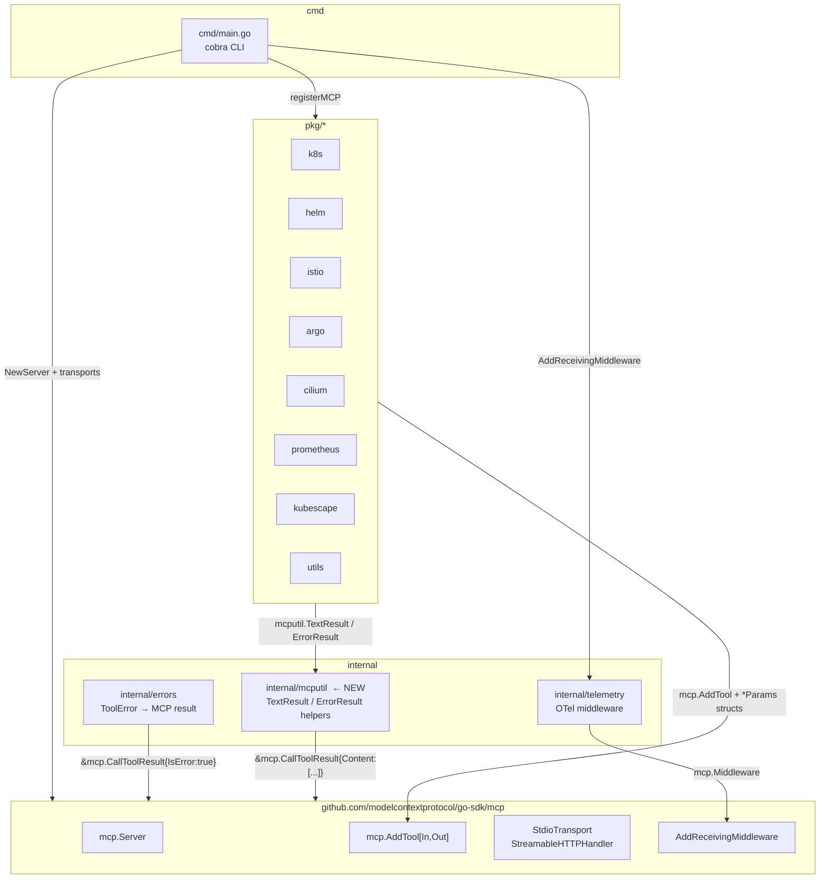

# Design: Migrate mark3labs/mcp-go → modelcontextprotocol/go-sdk

## Overview

This document describes the design for replacing the community MCP Go SDK
(`github.com/mark3labs/mcp-go v0.43.2`) with the official MCP Go SDK
(`github.com/modelcontextprotocol/go-sdk`) across the `kagent-tools` server.

The migration is a **drop-in SDK swap with a type-safety uplift**: all externally
visible behaviour (tool names, parameter names, transport protocols) is preserved,
while the internal implementation switches from dynamic map-based parameter parsing
to concrete Go struct types.

No new tools are added. No tools are removed. No CLI flags change.

---

## Detailed Requirements

### R1 — Concrete Go struct types (no `map[any]any`)

Every tool handler MUST receive its parameters as a named, exported Go struct.
Dynamic maps (`map[string]any`, `map[string]interface{}`, `map[any]any`) are
forbidden as tool parameter containers. Existing uses of `map[string]interface{}`
in `ToolError.Context` must also be replaced with a concrete type.

### R2 — Full feature parity

All 40+ tools across eight packages (k8s, helm, istio, argo, cilium, prometheus,
kubescape, utils) must be registered and functional after migration. Tool names,
parameter names, and descriptions must match the current implementation exactly.

### R3 — Both transports preserved

The server must continue to support:
- **stdio** (`--stdio` flag): communicates over stdin/stdout
- **HTTP Streamable** (default): listens on `--port` (default 8084)

### R4 — Telemetry / OpenTelemetry tracing preserved

The OTel tracing middleware that records tool name, arguments, duration, and
error state on every `tools/call` invocation must be rewritten using the
official SDK's `AddReceivingMiddleware` API. No tracing spans may be lost.

### R5 — 80 % overall / 70 % per-package / 90 % critical-package coverage

Test coverage thresholds defined in CLAUDE.md are unchanged. All updated
packages must pass `make test` after migration.

### R6 — No breaking changes to the public `RegisterTools` interface

Each `pkg/*/` package exposes `RegisterTools(s *mcp.Server, ...)`. The function
signature changes only the type of the first argument (from `*server.MCPServer`
to `*mcp.Server`). Callers in `cmd/main.go` are updated accordingly.

---

## Architecture Overview



### Key Architectural Decisions

| Decision | Rationale |
|----------|-----------|
| Use generic `mcp.AddTool[In, Out]` (not low-level `server.AddTool`) | Auto-derives JSON schema from struct tags; eliminates manual `mcp.WithString/Bool/Number` option calls |
| Introduce `internal/mcputil` package | Single source for `TextResult`/`ErrorResult` helpers; avoids duplicating `&mcp.CallToolResult{...}` literals across 40+ handlers |
| Replace per-handler `WithTracing` wrapper with server-level middleware | Cleaner separation; one middleware intercepts all tool calls; no adapter boilerplate per handler |
| Replace `ToolError.Context map[string]interface{}` with `map[string]string` | Satisfies R1; `interface{}` was only ever used with string values |

---

## Components and Interfaces

### `internal/mcputil` (new package)

```go
package mcputil

import "github.com/modelcontextprotocol/go-sdk/mcp"

// TextResult wraps a plain text string in a successful CallToolResult.
func TextResult(text string) *mcp.CallToolResult

// ErrorResult wraps an error message in a tool-error CallToolResult (IsError=true).
func ErrorResult(msg string) *mcp.CallToolResult
```

### `internal/telemetry/middleware.go` (rewritten)

```go
// Before
type ToolHandler func(ctx context.Context, request mcp.CallToolRequest) (*mcp.CallToolResult, error)
func WithTracing(toolName string, handler ToolHandler) ToolHandler
func AdaptToolHandler(th ToolHandler) server.ToolHandlerFunc

// After
// NewTracingMiddleware returns a mcp.Middleware that records OTel spans for
// every tools/call invocation. The tool name is read from req.(*mcp.CallToolRequest).Params.Name.
func NewTracingMiddleware() mcp.Middleware
```

All other telemetry helpers (`HTTPMiddleware`, `ExtractHTTPHeaders`, `StartSpan`,
`RecordError`, `RecordSuccess`, `AddEvent`) are unchanged.

### `internal/errors/tool_errors.go`

```go
// Context field type change
type ToolError struct {
    // ...
    Context map[string]string `json:"context,omitempty"`  // was map[string]interface{}
}

// ToMCPResult — result type changes; import changes from mark3labs to go-sdk
func (e *ToolError) ToMCPResult() *mcp.CallToolResult {
    return mcputil.ErrorResult(message.String())
}

// WithContext parameter type change
func (e *ToolError) WithContext(key string, value string) *ToolError
```

### `pkg/*/` — Tool handler pattern

Every handler is converted to the typed `ToolHandlerFor` pattern:

```go
// Params struct — one per tool
type <Action>Params struct {
    Field string `json:"field_name" jsonschema:"description[,required][,default=val]"`
    // ...
}

// Handler
func handle<Action>(
    ctx context.Context,
    req *mcp.CallToolRequest,
    args <Action>Params,
) (*mcp.CallToolResult, any, error) {
    // args.Field is already populated
    return mcputil.TextResult(result), nil, nil
}

// Registration
func RegisterTools(s *mcp.Server, readOnly bool) {
    mcp.AddTool(s, &mcp.Tool{
        Name:        "tool_name",
        Description: "...",
    }, handle<Action>)
}
```

### `cmd/main.go`

```go
// Server creation
mcpServer := mcp.NewServer(&mcp.Implementation{Name: Name, Version: Version}, nil)

// Middleware
mcpServer.AddReceivingMiddleware(telemetry.NewTracingMiddleware())

// Tool registration map
toolProviderMap := map[string]func(*mcp.Server){
    "k8s":   func(s *mcp.Server) { k8s.RegisterTools(s, nil, kubeconfig, readOnly) },
    // ...
}

// Stdio transport
func runStdioServer(ctx context.Context, s *mcp.Server) {
    if err := s.Run(ctx, &mcp.StdioTransport{}); err != nil { ... }
}

// HTTP transport
handler := mcp.NewStreamableHTTPHandler(
    func(r *http.Request) *mcp.Server { return mcpServer },
    nil,
)
mux.Handle("/", telemetry.HTTPMiddleware(handler))
```

---

## Data Models

### Params Structs per Package

All structs use `json` tags for field names and `jsonschema` tags for descriptions
and constraints. Required fields have `,required` appended to the jsonschema tag.

#### `pkg/k8s` — KubectlGetParams (representative)

```go
type KubectlGetParams struct {
    ResourceType  string `json:"resource_type"  jsonschema:"K8s resource type (pod/deploy/svc),required"`
    ResourceName  string `json:"resource_name"  jsonschema:"name of the specific resource"`
    Namespace     string `json:"namespace"      jsonschema:"namespace to query"`
    AllNamespaces bool   `json:"all_namespaces" jsonschema:"query across all namespaces"`
    Output        string `json:"output"         jsonschema:"output format (wide/json/yaml),default=wide"`
}
type KubectlLogsParams struct {
    PodName   string `json:"pod_name"   jsonschema:"pod name,required"`
    Namespace string `json:"namespace"  jsonschema:"namespace,default=default"`
    Container string `json:"container"  jsonschema:"container name"`
    TailLines int    `json:"tail_lines" jsonschema:"number of log lines,default=50"`
}
type ScaleDeploymentParams struct {
    Name      string `json:"name"      jsonschema:"deployment name,required"`
    Namespace string `json:"namespace" jsonschema:"namespace,default=default"`
    Replicas  int    `json:"replicas"  jsonschema:"desired replica count,default=1"`
}
// ... one struct per handler, following the same pattern
```

#### `pkg/helm` (representative)

```go
type HelmListParams struct {
    Namespace     string `json:"namespace"      jsonschema:"filter by namespace"`
    AllNamespaces bool   `json:"all_namespaces" jsonschema:"list across all namespaces"`
    All           bool   `json:"all"            jsonschema:"show all releases including non-deployed"`
    Uninstalled   bool   `json:"uninstalled"    jsonschema:"show uninstalled releases"`
    Failed        bool   `json:"failed"         jsonschema:"show failed releases"`
    Deployed      bool   `json:"deployed"       jsonschema:"show deployed releases"`
    Pending       bool   `json:"pending"        jsonschema:"show pending releases"`
    Filter        string `json:"filter"         jsonschema:"regex filter for release names"`
    Output        string `json:"output"         jsonschema:"output format (table/json/yaml)"`
}
type HelmGetReleaseParams struct {
    Name      string `json:"name"      jsonschema:"release name,required"`
    Namespace string `json:"namespace" jsonschema:"namespace,required"`
    Output    string `json:"output"    jsonschema:"output format (all/hooks/manifest/notes/values)"`
}
// ... one struct per handler
```

#### `pkg/argo` (representative)

```go
type VerifyArgoControllerParams struct {
    Namespace string `json:"namespace" jsonschema:"namespace to check,default=argo-rollouts"`
    Label     string `json:"label"     jsonschema:"pod label selector,default=app.kubernetes.io/component=rollouts-controller"`
}
type PromoteRolloutParams struct {
    RolloutName string `json:"rollout_name" jsonschema:"name of the rollout,required"`
    Namespace   string `json:"namespace"    jsonschema:"namespace"`
    Full        bool   `json:"full"         jsonschema:"fully promote skipping all pauses"`
}
// ...
```

#### `pkg/cilium` (representative)

```go
type UpgradeCiliumParams struct {
    ClusterName   string `json:"cluster_name"   jsonschema:"cluster name"`
    DatapathMode  string `json:"datapath_mode"  jsonschema:"datapath mode (tunnel/native-routing)"`
}
type InstallCiliumParams struct {
    ClusterName   string `json:"cluster_name"  jsonschema:"cluster name"`
    ClusterID     string `json:"cluster_id"    jsonschema:"unique cluster ID for cluster mesh"`
    DatapathMode  string `json:"datapath_mode" jsonschema:"datapath mode"`
}
type ConnectRemoteClusterParams struct {
    ClusterName string `json:"cluster_name" jsonschema:"remote cluster name,required"`
    Context     string `json:"context"      jsonschema:"kubeconfig context for remote cluster"`
}
type ToggleHubbleParams struct {
    Enable bool `json:"enable" jsonschema:"true to enable Hubble,default=true"`
}
// ...
```

---

## Error Handling

### Tool-level errors (visible to the LLM)

Returned as `*mcp.CallToolResult` with `IsError: true`. The LLM sees the error
text as tool output and can reason about it.

```go
// All paths that previously called mcp.NewToolResultError(msg):
return mcputil.ErrorResult(msg), nil, nil

// ToolError.ToMCPResult():
return mcputil.ErrorResult(message.String())
```

### Protocol-level errors (terminates the JSON-RPC call)

Returned as the `error` return value. Reserved for unexpected internal failures
that the LLM cannot meaningfully recover from.

```go
return nil, nil, fmt.Errorf("internal error: %w", err)
```

### Validation

Required fields in param structs are validated automatically by the SDK before
the handler is called. Manual `if param == "" { return error }` guards in
handlers are removed where the field is declared `required` in the jsonschema tag.
Optional guards for business logic remain.

---

## Acceptance Criteria

### AC-1: Dependency update

**Given** `go.mod` is updated to remove `github.com/mark3labs/mcp-go`
**When** `go mod tidy` is run
**Then** no references to `mark3labs/mcp-go` remain in `go.mod` or `go.sum`

### AC-2: No dynamic maps in tool params

**Given** the migrated codebase
**When** `grep -r "map\[string\]any\|map\[string\]interface{}" pkg/ internal/` is run
**Then** zero matches are found inside tool handler functions or param types

### AC-3: All tools register and are discoverable

**Given** the server is started in stdio mode
**When** a `tools/list` request is sent
**Then** all tool names present before migration are returned in the response

### AC-4: Stdio transport works

**Given** the server binary is run with `--stdio`
**When** a `tools/call` JSON-RPC request is piped to stdin
**Then** a valid JSON-RPC response with tool result is written to stdout

### AC-5: HTTP/Streamable transport works

**Given** the server is started without `--stdio` on port 8084
**When** an HTTP MCP client connects and calls a tool
**Then** the response is returned with correct content

### AC-6: Telemetry traces recorded

**Given** an OTel exporter is configured
**When** a tool call is made
**Then** a span named `mcp.tool.<tool_name>` is recorded with `mcp.tool.name` and duration attributes

### AC-7: Test coverage thresholds pass

**Given** `make test` is run
**Then** overall coverage ≥ 80%, per-package ≥ 70%, critical packages ≥ 90%

### AC-8: Linter passes

**Given** `make lint` is run
**Then** zero linting errors are reported

---

## Testing Strategy

### Unit tests (primary)

Each `pkg/*/` package uses the table-driven pattern from CLAUDE.md. After migration,
tests call the typed handler directly:

```go
func TestHandleKubectlGet(t *testing.T) {
    cases := []struct {
        name    string
        args    KubectlGetParams
        wantErr bool
    }{
        {name: "missing resource_type", args: KubectlGetParams{}, wantErr: true},
        {name: "valid get pods", args: KubectlGetParams{ResourceType: "pod", Namespace: "default"}, wantErr: false},
    }
    for _, tc := range cases {
        t.Run(tc.name, func(t *testing.T) {
            result, _, err := handleKubectlGet(context.Background(), &mcp.CallToolRequest{}, tc.args)
            // assert
        })
    }
}
```

No need to construct `mcp.CallToolRequest.Params.Arguments` maps in unit tests —
args are passed directly to the handler function.

### Middleware tests

`internal/telemetry/middleware_test.go` uses an in-memory transport pair
(`mcp.NewInMemoryTransports()`) to exercise the full request-response cycle
including middleware.

### Integration / E2E tests

`test/e2e/helpers_test.go` starts the full server binary and exercises both
transports. These tests are unchanged in scope; only the client-side MCP
type imports are updated.

---

## Appendices

### A. Technology Choices

| Component | Choice | Reason |
|-----------|--------|--------|
| MCP SDK | `github.com/modelcontextprotocol/go-sdk` | Official Anthropic/MCP Foundation SDK; long-term support; supports MCP spec 2025-06-18 |
| HTTP transport | `mcp.NewStreamableHTTPHandler` | Implements MCP spec 2025-03-26 streamable HTTP; supersedes legacy SSE |
| Schema generation | `mcp.AddTool[In, Out]` generics | Auto-derives JSON schema from struct tags; eliminates boilerplate |
| Result helpers | `internal/mcputil.TextResult/ErrorResult` | Single source of truth; go-sdk has no built-in equivalents |

### B. API Mapping Summary

| mark3labs | go-sdk |
|-----------|--------|
| `server.NewMCPServer(n,v)` | `mcp.NewServer(&mcp.Implementation{Name:n,Version:v}, nil)` |
| `server.NewStdioServer(s).Listen(ctx,in,out)` | `s.Run(ctx, &mcp.StdioTransport{})` |
| `server.NewStreamableHTTPServer(s,opts)` | `mcp.NewStreamableHTTPHandler(func(r)*mcp.Server{return s}, nil)` |
| `mcp.ParseString(req,k,d)` | Struct field with `json` tag |
| `mcp.ParseInt(req,k,d)` | Struct field with `json` tag |
| `mcp.NewTool(name, opts...)` | `&mcp.Tool{Name:"...",Description:"..."}` |
| `s.AddTool(tool, handler)` | `mcp.AddTool(s, tool, typedHandler)` |
| `mcp.NewToolResultText(t)` | `mcputil.TextResult(t)` |
| `mcp.NewToolResultError(t)` | `mcputil.ErrorResult(t)` |
| handler `(req, err)` 2-return | handler `(req, any, err)` 3-return |
| `server.ToolHandlerFunc` | `mcp.ToolHandlerFor[In, Out]` |
| `server.AdaptToolHandler` | `mcp.Middleware` via `AddReceivingMiddleware` |

### C. Alternative Approaches Considered

**Keep low-level `server.AddTool` with manual schemas** — rejected. This would
require replicating the existing `mcp.WithString/Bool/Number` boilerplate in a
new form and would not achieve R1 (typed structs).

**Use `map[string]any` args in handlers** — rejected. Explicitly forbidden by R1
and is a regression in type safety compared to even the mark3labs API.

**Introduce a compatibility shim layer** — rejected. A thin adapter keeping the
old signatures would prevent tests from using the cleaner direct-invocation
pattern and would accumulate technical debt.
